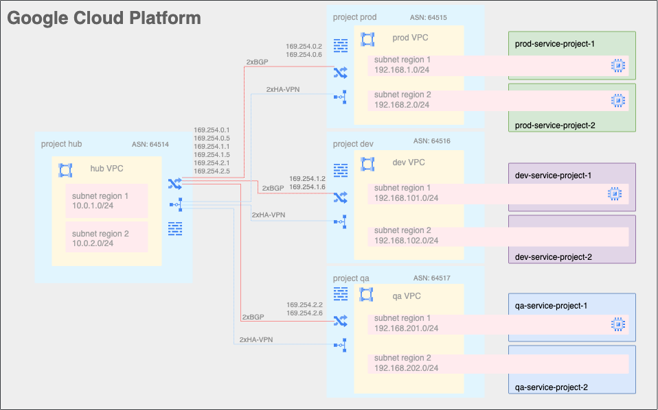

## Hub and Spokes VPCs using HA-VPN and Shared VPC
This blueprint creates a simple **Hub and Spoke** setup, where the VPC network connects satellite locations (spokes) through a single intermediary location (hub) via High Availability VPN.

## Pre-requisites
- 1 empty GCP Project as Hub Project
- 3 empty GCP Projects as Prod, QA, Test Host Projects
- 2 empty GCP Projects for Production Service Projects
- 2 empty GCP Projects for QA Service Projects
- 2 empty GCP Projects for Test Service Projects
- Compute engine API and Billing Account activated for all projects

To customize this code follow these instructions: 
Go to "havpn-hub-spokes" folder and customize "variables.tf" file
- [Mandatory] customize: Projects-ids (Hub & Hosts)
- [Mandatory] customize: Projects-ids (Service Projects)
- [optional] Customize: Regions, Subnets names and CIDRs

This code deploys this architecture 

## Managed resources and services

This sample creates several distinct groups of resources:

- Four VPC networks, one each for the hub and spokes, each with two subnets in different regions.
- HA-VPN configurations between the hub network and each spoke
- a Compute Engine VM instance for each VPC network. The VMs are created using an accompanying service account
- one set of firewall rules for each VPC network
- one test instance for each spoke
- VPN gateways in the hub and spokes networks with accompanying tunnels. These tunnels allow the Cloud Routers to exchange transitive routes so that resources in spoke-1 spoke-2 and spoke-3 can reach each other, and so that resources in the hub network can reach GCP future managed services (ie. Cloud SQL).
